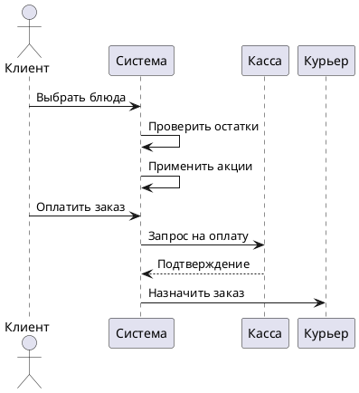

# Решение задания №1: Сеть ресторанов

---

## 1. Введение (2 балла)
Система автоматизации для сети ресторанов охватывает управление поставками, CRM, доставку, маркетинг и интеграцию с кассовыми системами. Решение включает:
- **Инфологическую модель** для описания предметной области в 3НФ.
- **Даталогическую модель** с физической реализацией БД.
- **Прототипы интерфейсов** для клиентов, курьеров и администраторов.
- **Сценарии использования**, описывающие ключевые бизнес-процессы.

Цель — минимизировать ручные операции, обеспечить аналитику и повысить лояльность клиентов.

---

## 2. Основная часть

### 2.1. Описание процессов и информационных потоков (6 баллов)

**Процессы:**
1. **Управление поставками:**
   - Заказ продуктов у поставщиков → приемка на склад → списание при приготовлении.
   - Интеграция с кассой для учета остатков.
2. **CRM:**
   - Регистрация клиентов → сбор отзывов → начисление баллов лояльности → таргетированные акции.
3. **Доставка:**
   - Создание заказа → назначение курьера → отслеживание статуса → закрытие заказа.
4. **Меню и акции:**
   - Обновление блюд → привязка к сезонным акциям → автоматическое применение скидок.

**Информационные потоки:**
- Клиент → заказ → данные о блюдах → склад (списание продуктов).
- Курьер → геолокация → обновление статуса доставки.
- Касса → фиксация оплаты → синхронизация с заказом и складом.

---

### 2.2. Структура БД (10 баллов)

**Инфологическая модель (3НФ):**


**Сущности:**
1. **Restaurant** (ID, Name, Address).
2. **Supplier** (ID, Name, Contact).
3. **Product** (ID, Name, ExpiryDate, SupplierID).
4. **Warehouse** (ID, RestaurantID, ProductID, Quantity).
5. **Dish** (ID, Name, Price, CategoryID).
6. **Order** (ID, ClientID, CourierID, Status, TotalPrice).
7. **Client** (ID, Name, Phone, LoyaltyPoints).
8. **Promotion** (ID, Name, Discount%, StartDate, EndDate).
9. **CashOperation** (ID, OrderID, Amount, DateTime).

**Связи:**
- Один ресторан → много складов (1:N).
- Многие продукты → много блюд (через **DishProduct** (DishID, ProductID, Quantity)).
- Клиент → много заказов (1:N).

**Даталогическая модель:**


**Пример таблицы `Order`:**
```sql
CREATE TABLE Order (
  ID INT PRIMARY KEY,
  ClientID INT FOREIGN KEY REFERENCES Client(ID),
  CourierID INT FOREIGN KEY REFERENCES Courier(ID),
  Status VARCHAR(20) CHECK (Status IN ('Pending', 'Cooking', 'Delivering', 'Completed')),
  TotalPrice DECIMAL(10,2),
  CreatedAt DATETIME
);
```

---

### 2.3. Прототипы интерфейсов (5 баллов)

**1. Страница клиента:**
- **Меню:** Фильтры по категориям, поиск, корзина с применением промокодов.
- **Личный кабинет:** История заказов, баллы лояльности, отзывы.
- **Отслеживание заказа:** Карта с маршрутом курьера, ETA.

**2. Админ-панель:**
- **Управление меню:** CRUD для блюд, привязка к акциям.
- **Аналитика:** Графики продаж, остатки на складе.

**3. Интерфейс курьера:**
- **Список заказов:** Сортировка по приоритету, кнопка "Доставлено".
- **Навигация:** Интеграция с Google Maps API.

---

### 2.4. Варианты использования (5 баллов)

**Сценарий: Оформление заказа с акцией**
1. Клиент выбирает блюда → добавляет в корзину.
2. Система проверяет доступные акции (напр., "Скидка 20% на пиццу").
3. Клиент применяет промокод → сумма пересчитывается.
4. Оплата через интеграцию с кассой → списание продуктов со склада.
5. Назначение курьера → уведомление клиенту и курьеру.

**Диаграмма:**


---

## 3. Заключение (2 балла)
Решение обеспечивает:
- Автоматизацию ключевых процессов (поставки, CRM, доставка).
- Соответствие 3НФ для минимизации аномалий.
- Гибкую интеграцию с кассовыми системами.
- Удобные интерфейсы для всех участников.

Реализация системы повысит эффективность бизнеса и удовлетворенность клиентов, что критически важно для спасения вселенной.